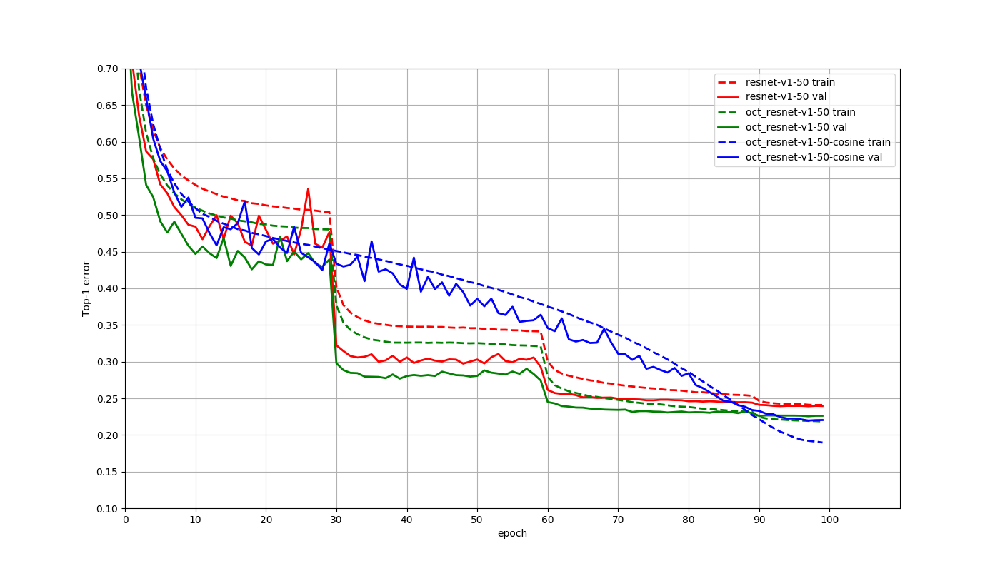

# OctaveConv
A MXNet Implementation for Drop an Octave

This repository contains a [MXNet](https://github.com/apache/incubator-mxnet) implementation of the paper [Drop an Octave: Reducing Spatial Redundancy in Convolutional Neural Networks with Octave Convolution](https://arxiv.org/abs/1904.05049). 

| Model                  |  Top1  |
| :--------------------- | :----: |
| ResNet-v1-50           |  76.05 |
| OctResNet-v1-50        |  77.47 |
| OctResNet-v1-50-cosine |  78.04 |

OctResNet-v1-50-cosine model used alpha = 0.25 in the table 2 of the paper. 

## To Do List
- [ ] support mobilenet v1/v2

## Acknowledgment
This repo is based on [DPN](https://github.com/cypw/DPNs). 

## UPDATE 
Here is the official implementation: https://github.com/facebookresearch/OctConv (Highly Recommend!)
